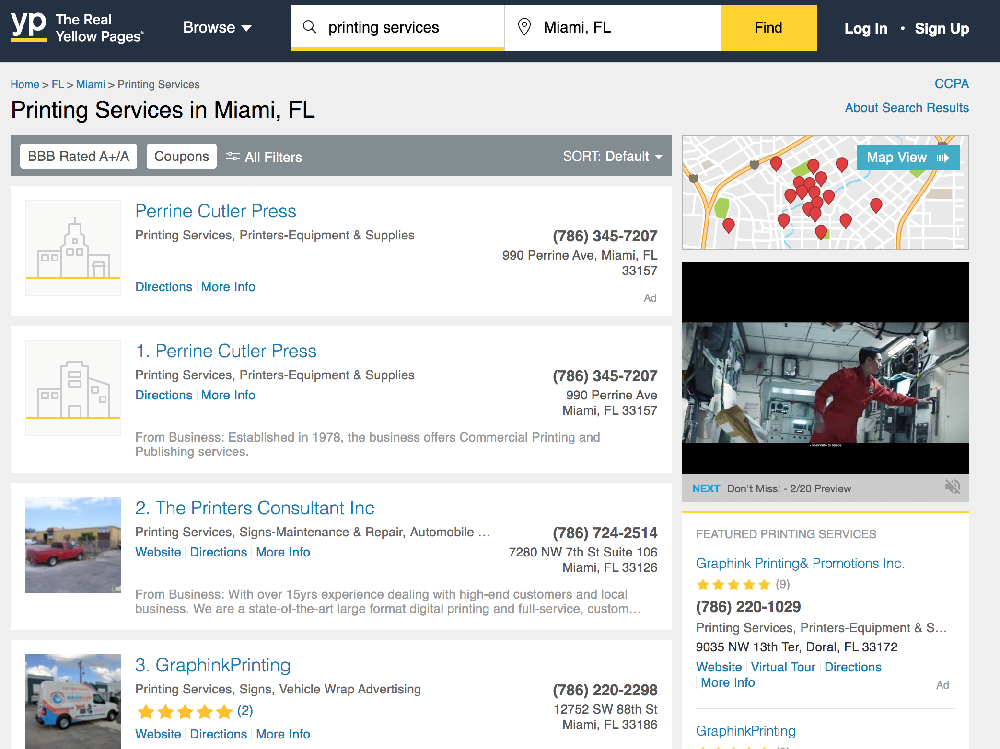
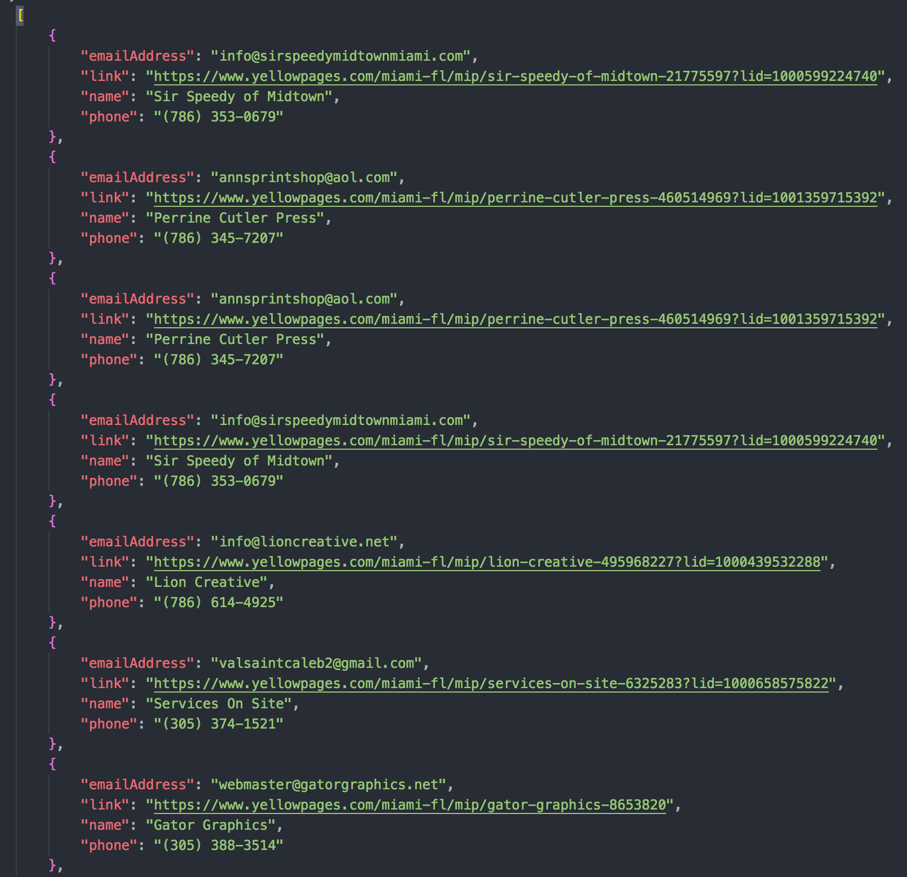

## Scraping to the Yellow Pages

This a project where we gather data from Miami Local Businesses that offer Printing Services

By running this script you get all the Phone Numbers and Emails from those businesses that get stored in a JSON file that looks like this

## NodemailerJS

If wanted, I implemented nodemailer to build email campaigns. You just need to pass your credentials.

